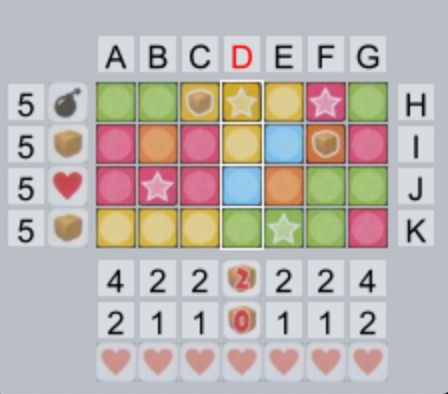
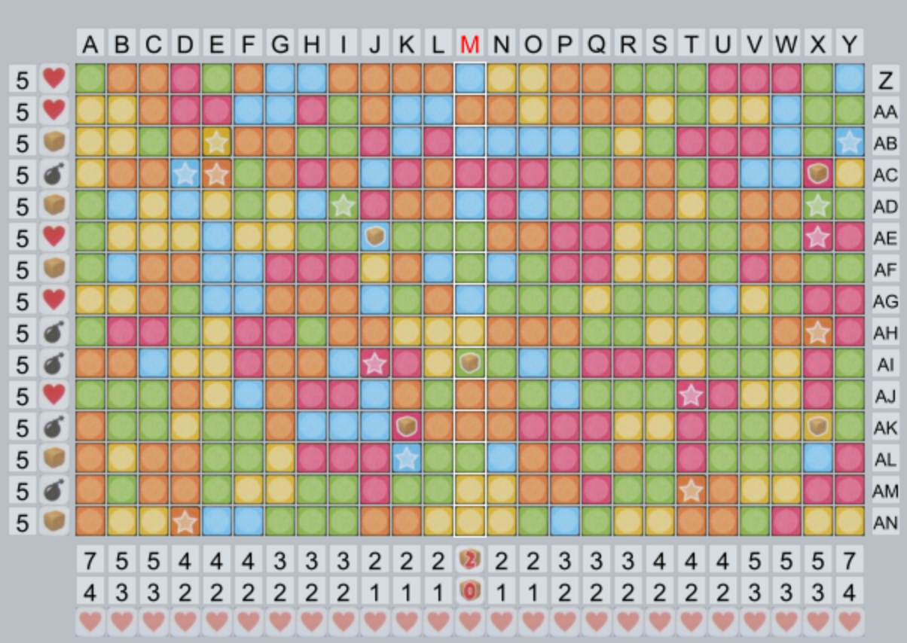

# timeaftertime

This repository contains a 'Keer op Keer 2' board generator.

Unlike for the first installment of the series there is only a single playing board available for Keer op Keer 2. Therefore, I set out to create a playing board generator to create custom playing boards.

## Actual vs generated playing board

Actual playing board:

Generated playing board (normal size):

## Custom playing boards

Generated playing board (small):

Generated playing board (large):

## Author(s)
Robbert-Jan 't Hoen